# pycharmDownload
pycharm下载与破解
## 一、下载pycharm
1. 打开pycharm[官网](https://www.jetbrains.com/pycharm/)
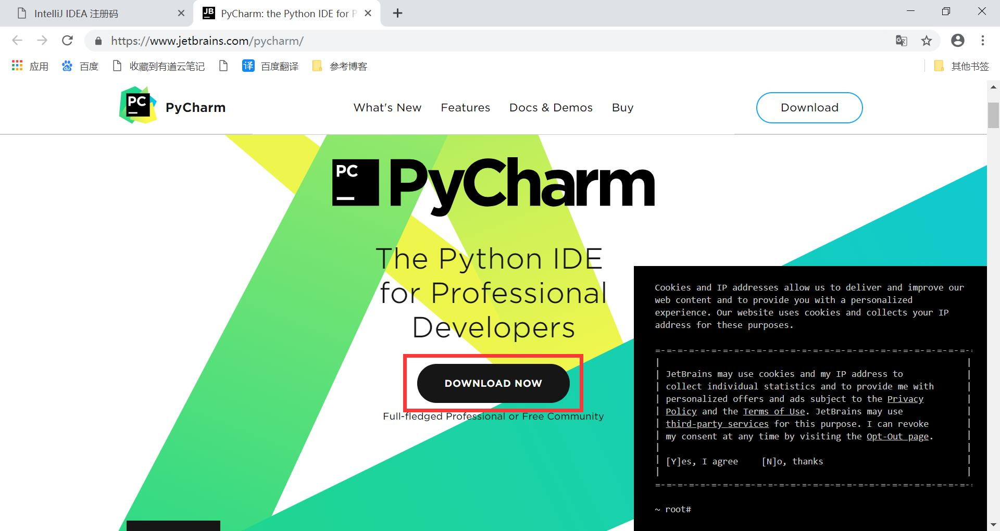  

2. 点击下载选择专业版下载，专业版有更多功能。  

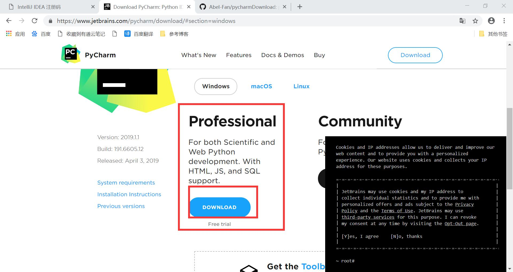

3. 打开安装包进行安装
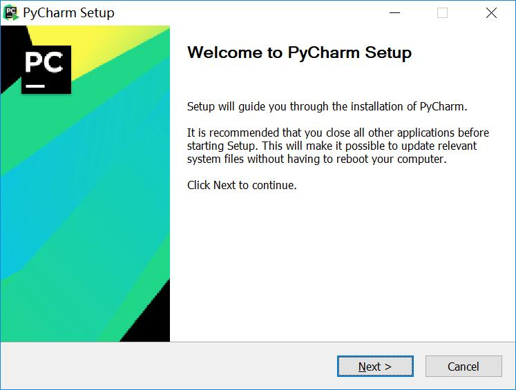

4. 选择安装路径，这里选择的是默认路径
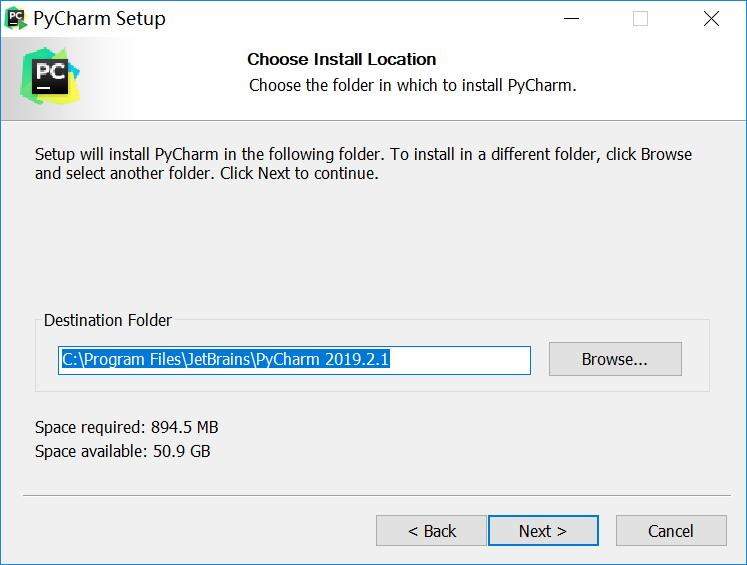

5. 选择安装选项，一般全部选择
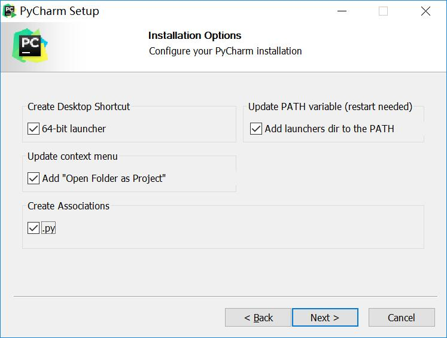

6. 点击 install 进行安装
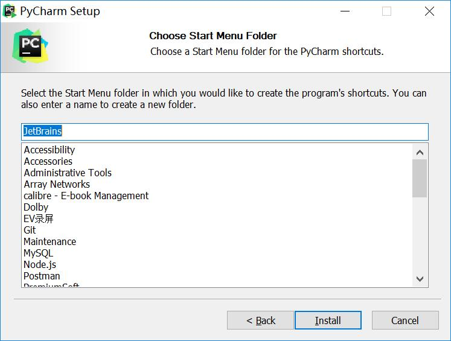

7. 完成安装
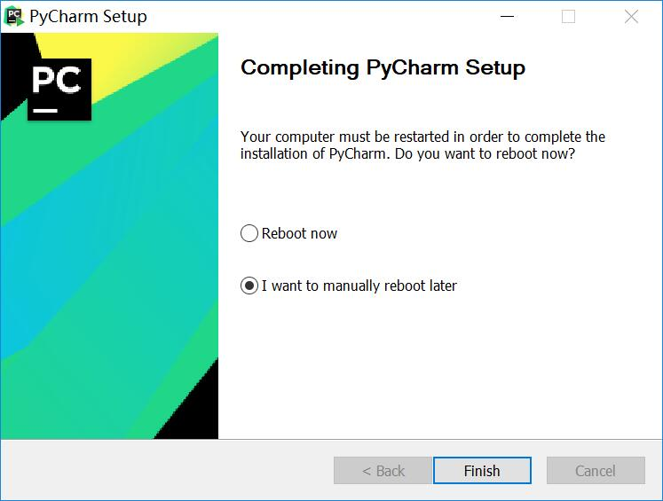

8. 打开应用
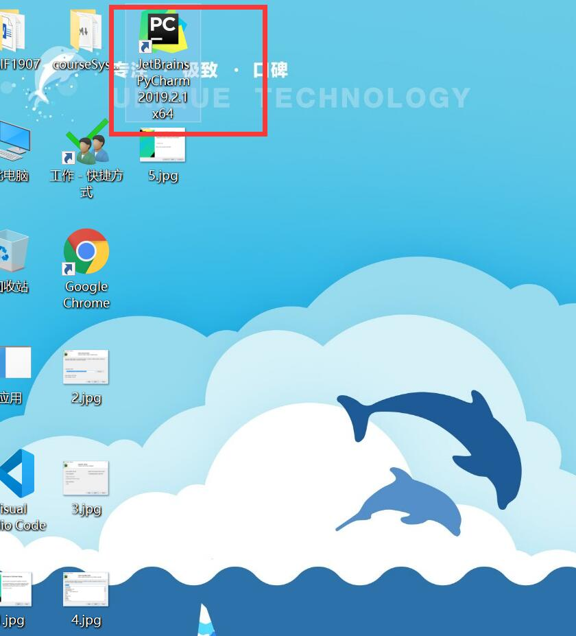

9. 选择设置文件 第一次安装选择第三项
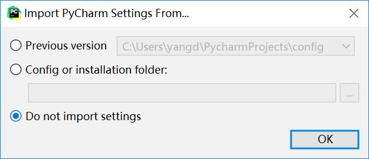

10. 跳过介绍弹窗
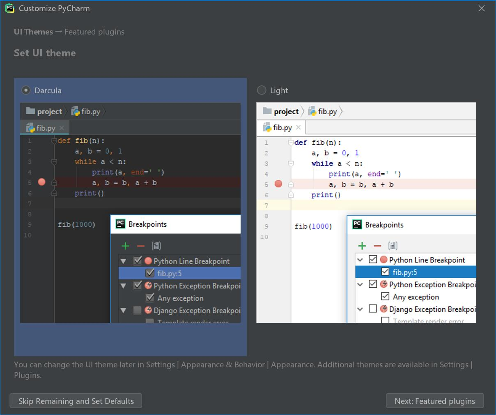

11. 填写注册码
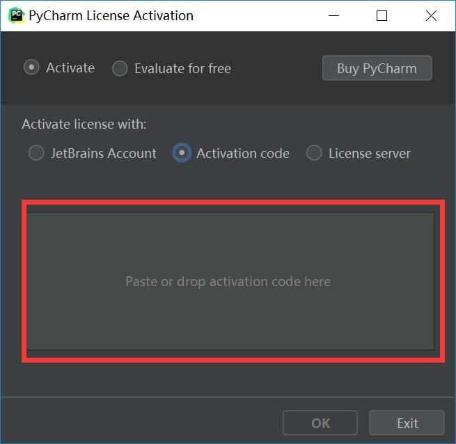

>#### 二、破解pycharm
1. 下载完成之后打开pycharm
激活码获取位置   

2. 打开蓝宇[官网](http://idea.lanyus.com/)
在蓝宇官网最底部获取最新激活码 
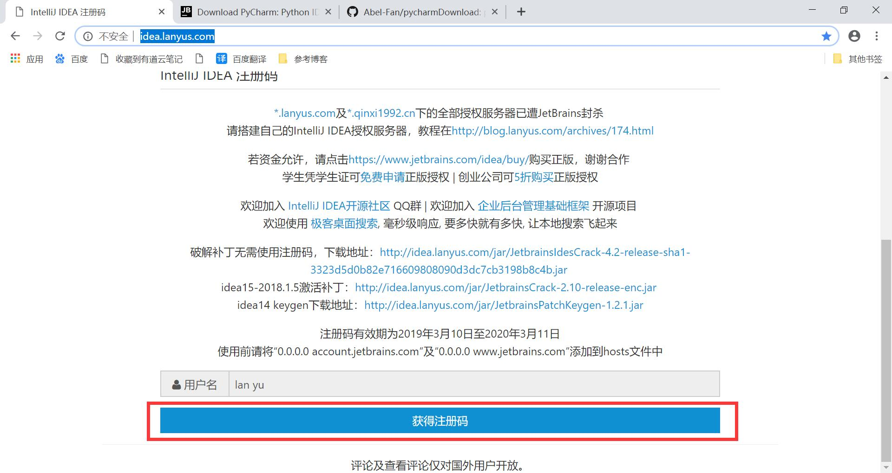 
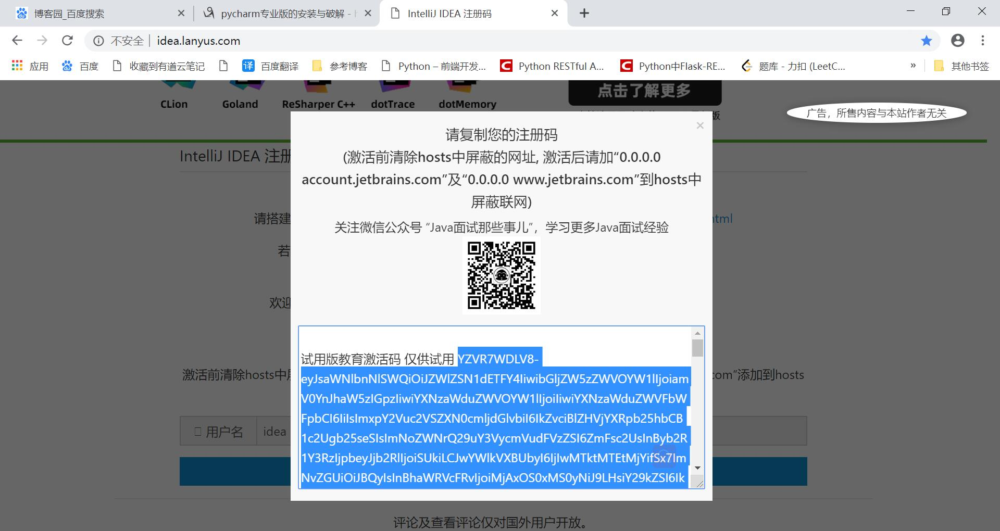
3. 在pycharm输入激活码位置写入激活码  
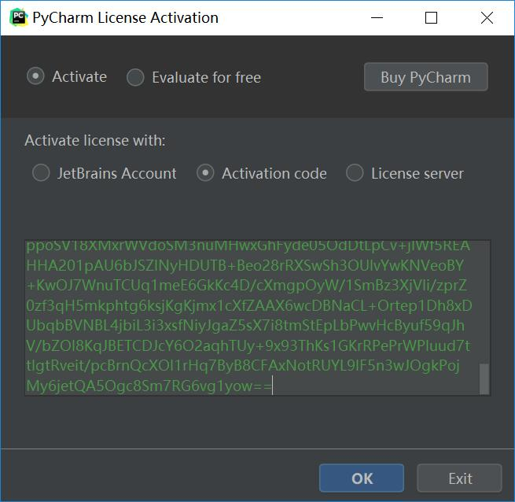
4. 完成破解
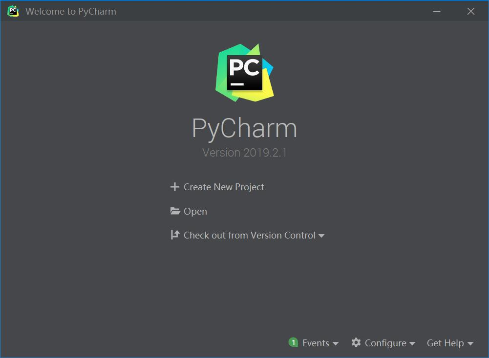
